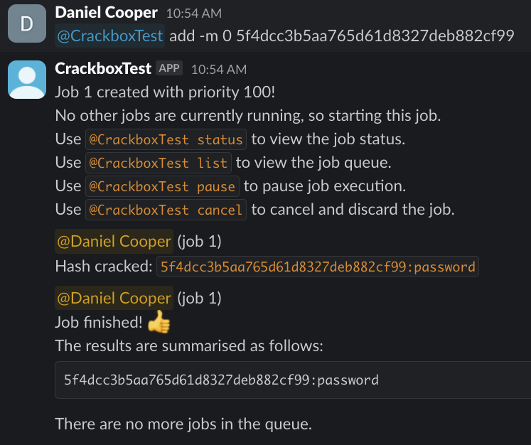

# Slashcat

Slashcat is an adapter between [Hashcat](https://hashcat.net/hashcat/) and [Slack](https://slack.com/) or [Discord](https://discord.com/).

## Features

* Hashcat features such as hash detection, wordlists, rules, masked bruteforce attacks, incremental mode, custom charsets
* Choice between Slack and Discord
* Job queue
    * Automatically starts the next job after one finishes
    * Supports multiple users, and pings users when the job is done
    * Custom job priority support
* Pausing and resuming jobs (even ones that normally can't be paused in Hashcat!)
* Multihash cracking
    * Supports file input

## Installation, Usage and Development

Please refer to the [wiki](https://github.com/tantosec/slashcat/wiki).
